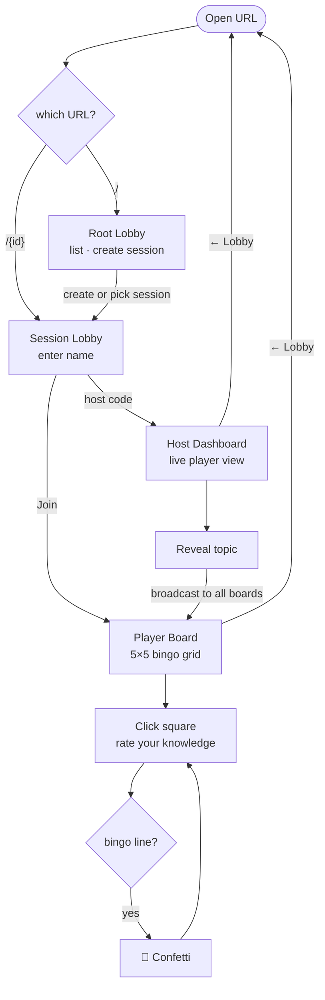
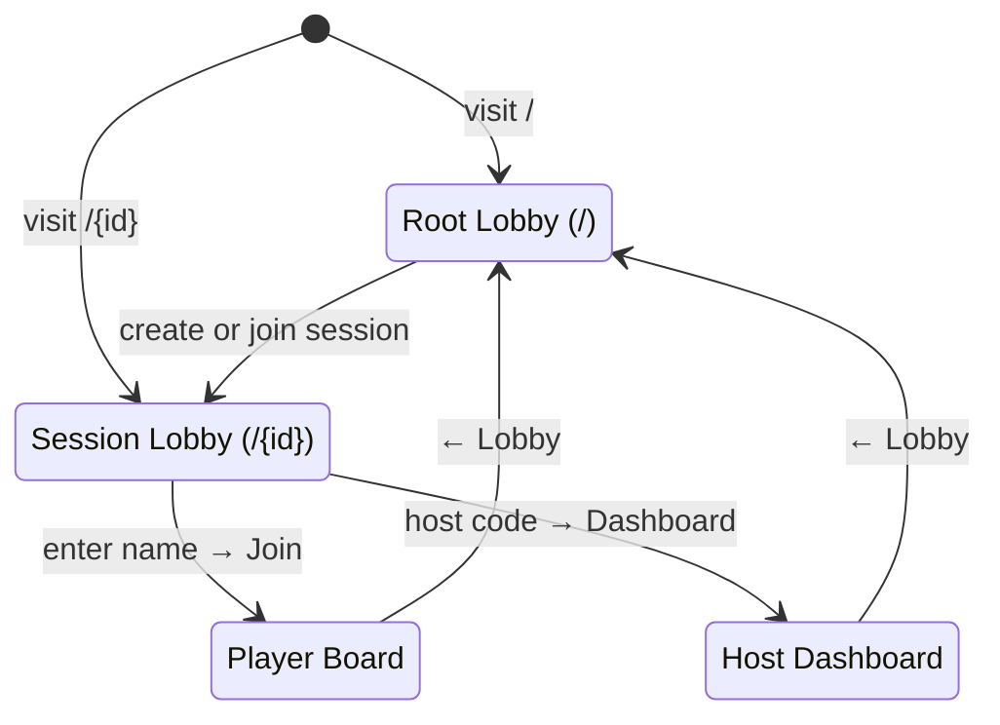

# Developer Guide

## App flow

### User journey



### Screen state (App.jsx)

The app is a single React tree. `screen` is a state variable; navigating back to the lobby is a full page load to `/`.



## Setup

```bash
git clone <repo>
cd bingo-app
npm install
```

## Run locally

```bash
npm run dev        # http://localhost:5173
```

Open a second tab and click **Host Dashboard** to simulate multiplayer. The app uses `BroadcastChannel` locally — no backend needed for frontend dev.

## View AWS resources

```bash
# List all resources tagged project=presentation-bingo
aws resourcegroupstaggingapi get-resources \
  --tag-filters Key=project,Values=presentation-bingo \
  --query 'ResourceTagMappingList[].ResourceARN'
```

Or in the console: **Resource Groups & Tag Editor** → search tag `project: presentation-bingo`.

## View logs

**Frontend (browser)**
Open DevTools → Console. WebSocket connection events and errors are logged there.

**Lambda (CloudWatch)**

```bash
# Tail logs for a specific function (replace FUNCTION_NAME)
aws logs tail /aws/lambda/FUNCTION_NAME --follow

# Or filter by session
aws logs filter-log-events \
  --log-group-name /aws/lambda/bingo-updateHandler \
  --filter-pattern '{ $.sessionId = "demo2026" }'
```

**API Gateway access logs**

```bash
aws logs tail /aws/apigateway/bingo-ws --follow
```

## Deploy backend

```bash
cd infra/
sam build && sam deploy --guided   # first time
sam build && sam deploy            # subsequent
```

The WebSocket endpoint URL is printed in the SAM output. Set it as `VITE_WS_URL` in a `.env.local` file for local dev against the live backend.

Or use the deploy script which writes `.env.local` automatically:

```bash
bash scripts/deploy.sh
```

## Deploy frontend (Amplify Hosting)

1. In the **AWS Amplify** console, create a new app and connect your Git repo
2. Amplify auto-detects `amplify.yml` for build settings
3. Add environment variable `VITE_WS_URL` (the WebSocket URL from the backend deploy)
4. Add a **rewrite rule** for SPA routing:
   - Source: `</^[^.]+$|\.(?!(css|gif|ico|jpg|js|png|txt|svg|woff|woff2|ttf|map|json)$)([^.]+$)/>` → Target: `/index.html` → Type: `200`
5. Optionally add custom domain `bingo.joelbreit.com` under **Domain management**
